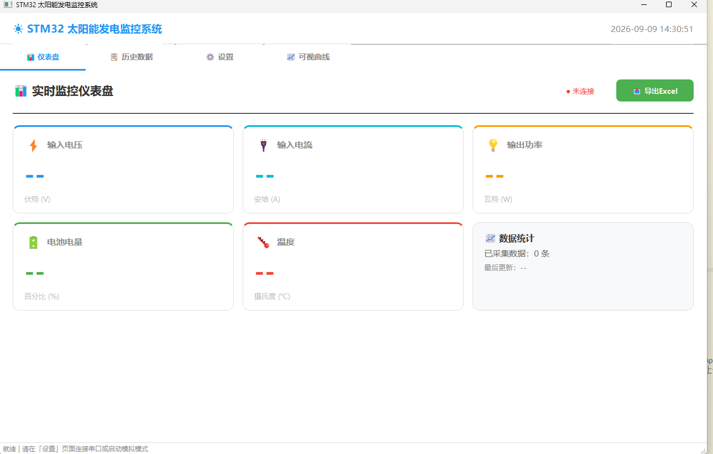

# STM32 太阳能监测与保护系统

这是一个基于 STM32F103C8 的太阳能/外部直流电源监测与过压保护项目，包含嵌入式固件与 PyQt 上位机。固件采集输入与输出电压、电流，计算功率，并依据可配置的电压阈值控制继电器和声光报警；上位机通过串口实时显示数据、绘制曲线、查询历史记录并导出 Excel。

## 功能

- 通过 PA0 ADC 采集光伏输入电压；程序中的分压换算倍率为 5。
- 通过 INA219 读取分流电压并计算电流与功率。
- OLED 实时显示输入电压、电流、阈值、继电器状态和系统状态。
- PB12、PB13、PB14 按键用于进入阈值设置、增大和减小阈值。
- 阈值保存至备份寄存器，断电后可恢复。
- USART1 以 115200 bps 输出监测数据，也可接收 0–25 V 的阈值设置值。
- 输入电压超过阈值时断开继电器并触发蜂鸣器与指示灯报警。
- PyQt 上位机提供仪表盘、历史数据、设置与可视曲线四个页面，支持串口模拟和 Excel 导出。

## 系统组成

```text
STM32F103C8 固件 ── USART1 / USB-TTL（115200, 8N1）── PyQt 上位机
       │                                                    │
       ├─ PA0：输入电压采样                              ├─ 实时仪表盘与串口终端
       ├─ INA219：电流采样                               ├─ 历史记录与 Excel 导出
       ├─ OLED / 按键 / 报警 / 继电器                    └─ 输入、输出与功率曲线
       └─ 周期上报监测数据，接收保护阈值命令
```

详细引脚定义、模块连接和电平注意事项见 [硬件连接说明](docs/硬件连接说明.md)，串口字段和命令格式见 [串口通信协议](docs/串口通信协议.md)。

## 开发环境

- MCU：STM32F103C8（Cortex-M3）
- IDE：Keil MDK（工程文件：`Project.uvprojx`）
- Keil Device Family Pack：`Keil.STM32F1xx_DFP.2.2.0`
- 也提供 EIDE 项目配置：`.eide/eide.yml`

## 构建与烧录

1. 在 Keil MDK 中打开 `Project.uvprojx`。
2. 安装或选择 `Keil.STM32F1xx_DFP` 设备包，并确认目标设备为 `STM32F103C8`。
3. 编译 Target 1；生成的 `.hex`、`.axf` 等产物会被 Git 忽略。
4. 使用 ST-Link、J-Link 或与你的调试器匹配的下载配置烧录程序。

## 上位机运行

上位机位于 `上位机/`，使用 PyQt5、pyqtgraph、pyserial 与 openpyxl。建议使用 Python 3.10 或更新版本。

```powershell
cd 上位机
python -m venv .venv
.\.venv\Scripts\Activate.ps1
pip install -r requirements.txt
python main.py
```

在“设置”页选择 USB-TTL 对应的串口和 `115200` 波特率后连接；未接硬件时可使用“模拟模式”体验界面。Excel 默认导出到桌面，也可在设置页更改位置。

> 如果 PowerShell 阻止激活虚拟环境，可改用 `cmd` 中的 `.venv\Scripts\activate.bat`，或在已安装依赖的 Python 环境直接运行 `python main.py`。

## 界面预览

上位机包括实时仪表盘、输入/输出特性曲线、历史记录与系统设置页面。



*上位机仪表盘：连接状态、实时数据卡片、数据统计与 Excel 导出入口。*

## 测试

仓库提供遥测格式化的基础测试。安装 GCC 后，可在仓库根目录运行：

```powershell
gcc -std=c99 -IHardware tests/test_telemetry.c Hardware/Telemetry.c -o telemetry_test
.\telemetry_test
```

预期输出：`telemetry tests passed`。

## 目录结构

- `User/`：程序入口与中断配置
- `Hardware/`：OLED、INA219、按键、报警、串口与电压监测驱动
- `System/`：系统通用功能
- `Library/`：STM32 标准外设库
- `Start/`：启动文件与 CMSIS 相关文件
- `tests/`：可在主机上运行的固件逻辑测试
- `上位机/`：PyQt 上位机源码与 Python 依赖清单
- `docs/`：硬件接线、串口协议及项目文档

## 许可证

本项目的原创代码采用 [MIT License](LICENSE)。`Library/` 与 `Start/` 中包含的 STMicroelectronics 标准外设库和 ARM CMSIS 文件不因本许可证而被重新授权；其版权与使用条件见 [第三方软件声明](THIRD_PARTY_NOTICES.md) 及各文件头部。
